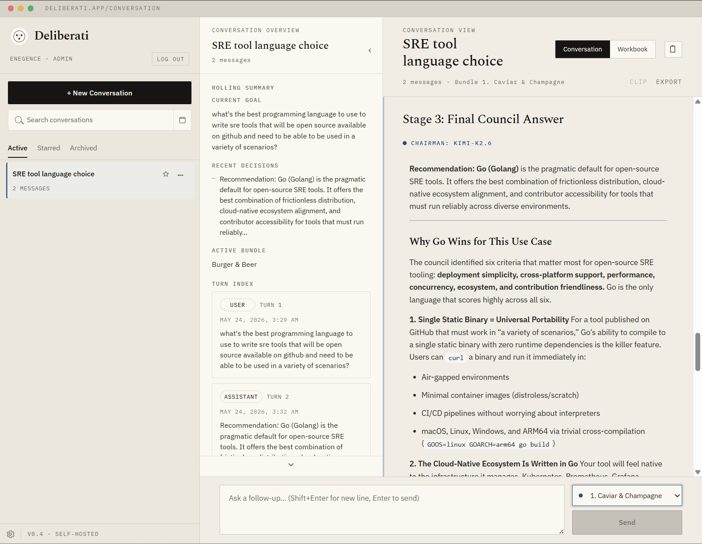

# Deliberati



> *Like the Illuminati, but they actually show their work.*

A self-hosted app for persistent back-and-forth with a council of LLMs that deliberates and synthesizes better verdicts than any single model. Conversations are starred, searched, archived, summarized, clipped, and exported — building a knowledge base over time rather than a pile of throwaway chat windows.

---

## Why a council?

A single model optimizes for confident-sounding output. The council structure forces disagreement, then resolves it.

**The High-Stakes Career Pivot** — Considering quitting a stable job to join a risky AI startup? One model says go, another says don't. The Chairman weighs both without the yes-man drift a single model defaults to.

**Evaluating a Medical Symptom** — A confusing lab result before you see a specialist. You don't want one model's prior; you want models to challenge each other's differential diagnosis.

**Reviewing a Contract** — An apartment lease or employment agreement with clauses you need to understand. Different models catch different things; the Chairman surfaces the real risks.

**Sanity-Checking a Pet Theory** — Weeks of reading, a new angle on a historical or economic question. Independent agents poke holes from incompatible directions; weak arguments don't survive the cross-review.

---

## How it works

Each query runs three stages:

1. **Stage 1 — First opinions.** All council models answer independently. Responses are shown in a tab view so you can inspect each one.

2. **Stage 2 — Peer review.** Each model receives the other models' responses with identities anonymized ("Response A", "Response B", ...). Models rank and critique without knowing who wrote what. Parsed rankings and raw evaluation text are both shown.

3. **Stage 3 — Chairman synthesis.** A designated Chairman model reads all responses and rankings and writes the final answer.

4. **Stage 4 — Follow-up (optional).** Continue the conversation with follow-up questions. The previous verdict is provided as context, so the council builds on what it already decided rather than starting cold.

---

## Setup

### Quick start

```bash
git clone <repo>
cd deliberati
./setup.sh
./start.sh
```

`setup.sh` checks for dependencies (`uv`, `npm`), prompts for your OpenRouter API key, and installs Python and JS packages.

`start.sh` auto-finds available ports, starts Postgres via Docker if no `DATABASE_URL` is set, launches the backend, worker, and frontend, and waits for everything to be ready.

### First launch

Open the URL printed by `start.sh`. If no admin account exists yet, the app will prompt you to create one. That's the only setup step for auth — no seed scripts needed.

### Manual `.env`

Instead of running `setup.sh`, copy `.env.example` and fill it in:

```bash
cp .env.example .env
```

Minimum required:

```bash
OPENROUTER_API_KEY=sk-or-v1-...
```

### Configure the council

Edit `backend/config.py` to set which models form the council and which is Chairman:

```python
COUNCIL_MODELS = [
    "openai/gpt-5.1",
    "google/gemini-3-pro-preview",
    "anthropic/claude-sonnet-4-5",
    "x-ai/grok-4",
]

CHAIRMAN_MODEL = "google/gemini-3-pro-preview"
```

Any model available on [openrouter.ai](https://openrouter.ai/) works. The council size is not fixed — add or remove entries freely.

Model bundles can also be managed from the UI without editing config files.

---

## Docker / Production

A `Dockerfile` and `docker-compose.example.yml` are included for production use (tested on Unraid, works anywhere Docker runs).

```bash
docker compose -f docker-compose.example.yml up --build
```

The compose file runs three containers: `webapp` (FastAPI + built frontend), `worker` (async post-processing), and `postgres`. The app is available on port `8002` by default.

```bash
COUNCIL_WEBAPP_PORT=18002 docker compose -f docker-compose.example.yml up --build
```

The webapp container serves the built Vite frontend as static files — no separate frontend container in production.

See [docs/unraid-deployment.md](docs/unraid-deployment.md) for Unraid-specific notes and volume layout.

---

## Features

- **Multi-model council** — parallel queries, configurable council composition
- **Anonymous peer review** — models rank each other without knowing who wrote what
- **Chairman synthesis** — single clean final answer from a designated model
- **Persistent conversations** — JSON transcripts on disk as source of truth
- **Postgres metadata layer** — rolling memory, turn index, export jobs, semantic chunks, entity links
- **Async worker** — background post-processing (memory summarization, search indexing, markdown/Obsidian exports)
- **Semantic search** — search across conversations using pgvector embeddings
- **Model bundles** — save and switch between named council configurations
- **Multi-user auth** — local username/password, session cookies, admin/member roles
- **Obsidian export** — conversations exported as linked markdown vaults

---

## Tech stack

- **Backend:** FastAPI (Python 3.10+), async httpx, psycopg3, pgvector
- **Frontend:** React + Vite, react-markdown
- **Database:** Postgres with pgvector extension
- **Package management:** uv (Python), npm (JS)
- **LLM routing:** [OpenRouter](https://openrouter.ai/)

---

## Credits

This is based on the original [LLM Council](https://github.com/karpathy/LLMCouncil) provided by [Andrej Karpathy](https://x.com/karpathy). I have modified this heavily to suit my needs, but the core idea is the same. Code is provided as-is. Ask your own LLM to modify it however you like.
